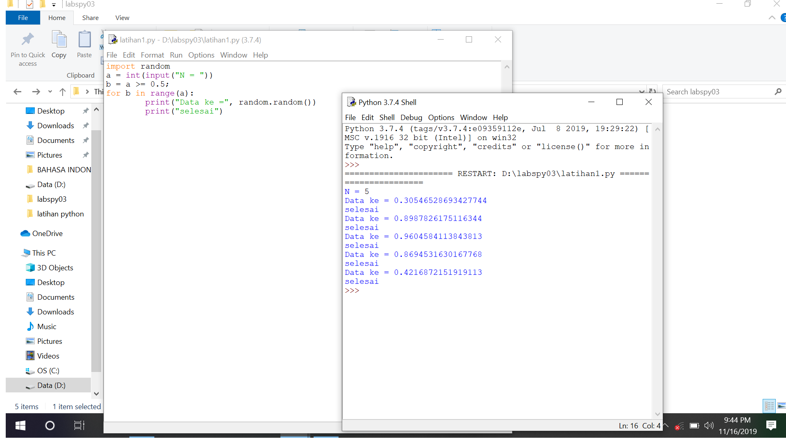
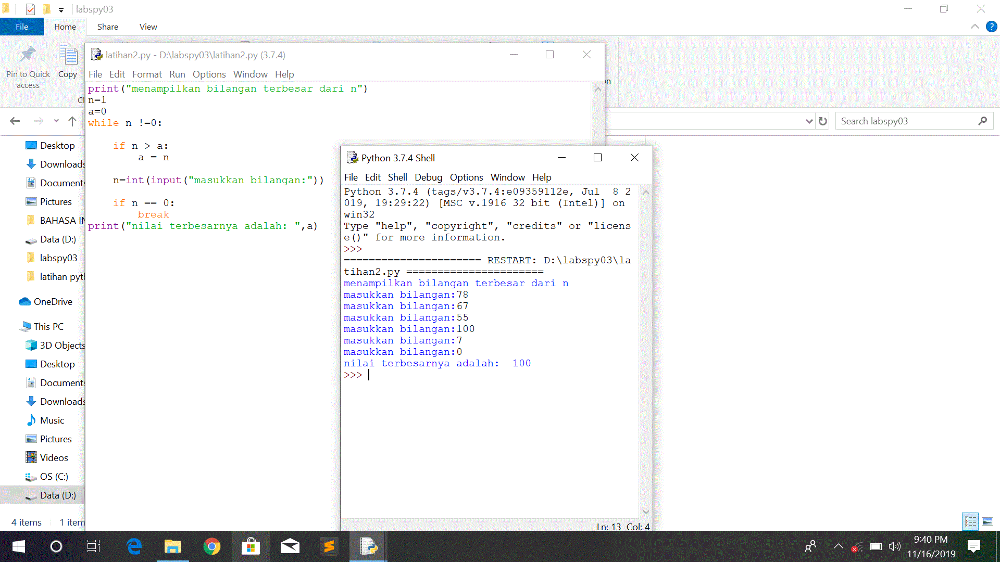
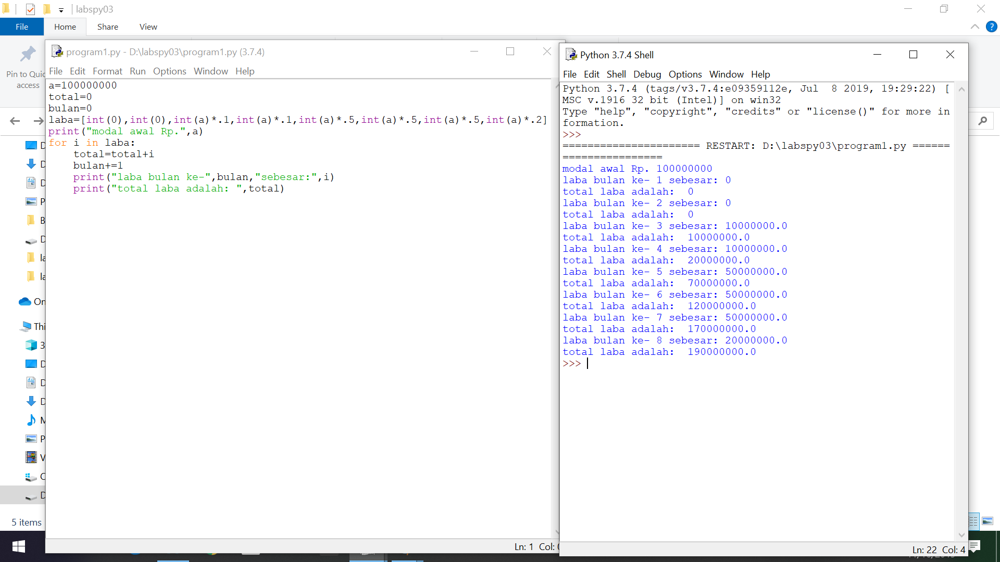

# Penjelasan Tugas 3

<strong>Penjelasan latihan 1</strong>
1. Masukkan nilai input. Nilai input ini berfungsi untuk menampilkan banyak data. Anda bisa memasukkan nilai berapa saja.
2. Dengan menggunakan fungsi random. Yakni, fungsi yang akan menampilkan angka dibawah 0.5 secara acak. Fungsi random sudah otomatis ditampilkan. 
3. Ketika anda sudah memberikan input nilai, maka akan langsung muncul 
data nilai random.

Hasil latihan1 :

Penjelasan latihan2
1. Masukkan bilangan
2. Program akan terus mengulang untuk meminta anda memasukkan bilangan.
3. Pengulangan akan berhenti ketika anda memasukkan angka 0 (nol).
4. Lalu akan ditampilkan bilangan terbesar dari semua bilangan yang anda input. Untuk mencari bilangan terbesar dari banyaknya bilangan menggunakan fungsi max.

Hasil latihan2 :

Penjelasan program1 
1. Modal awal pengusaha sebesar 100000000
2. Untuk menghitung laba perbulan maka harus diinputkan terlebih dahulu besarnya presentase keuntungan perbulan.
3. Selanjutnya, hasil laba perbulan akan ditampilkan. Disini anda bisa menggunakan looping berupa for, untuk menampilkan kembali jumlah laba yang telah dihitung berdasarkan presentasenya.
4. Terakhir akan ditampilkan jumlah laba secara keseluruhan yang didapat .

Hasil Program1 :

